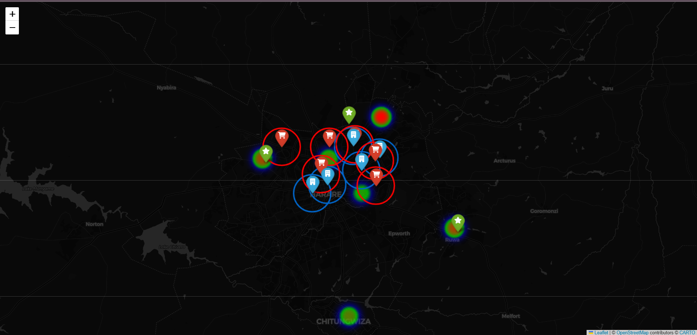

# 🌍 Africa Capital Flow Engine
### Strategic Real Estate Intelligence & GIS Site Selection System

   

## 📖 Project Overview
The **Africa Capital Flow Engine** is a high-performance Data Science portfolio project designed to demonstrate the future of PropTech in African markets.

Built as a **conceptual tribute** to the innovative investment strategies of market leaders like **Terrace Africa** and **WestProp Holdings**, this tool showcases how advanced econometrics and spatial algorithms can solve the two hardest questions in development:
1.  **Macro-Strategy:** *When* to deploy capital? (Forecasting Liquidity & FDI)
2.  **Micro-Execution:** *Where* to break ground? (GIS Site Selection)

> **Note:** This is an independent educational project. It is not an official product of Terrace Africa or WestProp Holdings, but rather a demonstration of how their strategic foresight can be encoded into a Decision Support System (DSS).

---

## 🚀 Key Features

### 1. The Macro-Forecasting Dashboard
A "Nowcasting" engine that uses **Vector Autoregression (VAR)** models to predict FDI inflows 12–60 months out. It correlates real-time global drivers (Oil, Gold, USD Index) to forecast liquidity in key markets:
* **Zimbabwe:** Modeled on mineral export resilience (Gold/Platinum pillars).
* **Nigeria:** Modeled on crude oil price sensitivity.
* **Kenya:** Modeled on energy import costs and currency fluctuation.

### 2. The GIS "Gap Hunter" Engine
A spatial algorithm that creates a **Retail Heatmap** of Harare. It plots existing portfolios against competitors and uses a Euclidean Distance Matrix to identify "White Space"—underserved high-density zones ripe for development (e.g., Ruwa Growth Point).

---

## 🗺️ Visual Intelligence (GIS Map)
*The system moves beyond spreadsheets to visualize opportunity. Below is the output of the "Gap Hunter" algorithm applied to Harare.*



### **Interpretation:**
* **🔵 Blue Markers (The Portfolio):** Simulating assets like *Borrowdale Village Walk* and *Highland Park*.
* **🔴 Red Markers (The Competition):** Mapping key rivals (e.g., *Sam Levy's Village*, *Westgate*).
* **⭐ Green Stars (The Algorithm's Choice):**
    * **Ruwa Growth Point:** Flagged as a **"Greenfield Opportunity."** The algorithm detected a high-density residential node with **zero Grade-A retail competition** within a 10km radius.
    * **Madokero Estate:** Identified as a strategic interceptor for the western expansion.

---

## 📸 Scenario Stress-Tests
*The engine runs dynamic economic scenarios based on live market correlations. Click the **Scenario Name** below to view the visual proof (Screenshot).*

| Scenario (Click to View) | Forecast Delta | Strategic Signal | Actionable Insight |
| :--- | :--- | :--- | :--- |
| [**1. Nigeria** (Oil Surge)](assets/Nigeria_Scenario.png) | **+2142.6%** | 🔥 Heating Up | **Aggressive Expansion:** High correlation (1.00) with global energy markets drives an extraordinary liquidity surge. Leverage cash to acquire distressed assets. |
| [**2. South Africa** (Growth)](assets/SA_Scenario.png) | **+77.9%** | 🔥 Heating Up | **Strategic Acceleration:** A strong upward trend supported by mineral pricing (Gold/Platinum). Focus on accelerating new development phases. |
| [**3. Egypt** (Recovery)](assets/Egypt_Scenario.png) | **+17.7%** | 🔥 Heating Up | **Cautious Optimism:** The market detects a stable recovery. Strategy shifts to tenant retention and protecting USD-equivalent yields. |
| [**4. Zimbabwe** (Anchor)](assets/Zimbabwe_Scenario.png) | **-15.7%** | 🔥 Heating Up | **Portfolio Consolidation:** Despite a mild contraction forecast, mineral export prices provide a critical buffer for the economy. Focus on defensive yields. |
| [**5. Kenya** (Energy Shock)](assets/Kenya_Scenario.png) | **-42.5%** | ❄️ Cooling Down | **Defensive De-Risking:** Negative correlation (-0.62) with oil prices triggers a downturn. Recommendation is to halt non-essential CapEx and increase cash reserves. |

---

## 🏗️ Project Structure
```text
Africa-Capital-Flow-Engine/
│
├── app.py                   # Main Streamlit Dashboard Application
├── model_engine.py          # VAR Econometric Model Logic
├── gis_engine.py            # GIS Spatial Algorithm (Gap Hunter)
├── data_generator.py        # ETL Pipeline (Yahoo Finance Scraper)
├── semi_synthetic_fdi.csv   # Structured Dataset (History + Nowcasting)
│
├── assets/                  # Project Artifacts
│   ├── Kenya_Scenario.png             # Screenshot of Kenya Dashboard
│   ├── Nigeria_Scenario.png           # Screenshot of Nigeria Dashboard
│   ├── Zimbabwe_Scenario.png          # Screenshot of Zimbabwe Dashboard
│   ├── SA_Scenario.png                # Screenshot of South Africa Dashboard
│   ├── Egypt_Scenario.png             # Screenshot of Egypt Dashboard
│   ├── Harare_Gap_Map_Screenshot.png  # Screenshot of GIS Map
│   ├── Harare_Gap_Hunter.html         # Interactive Map Output
│   └── Market_Reports/                # Folder containing the 5 PDF Reports
│       ├── Kenya_Market_Intelligence_Report.pdf
│       ├── Nigeria_Market_Intelligence_Report.pdf
│       ├── Zimbabwe_Market_Intelligence_Report.pdf
│       ├── South Africa_Market_Intelligence_Report.pdf
│       └── Egypt_Market_Intelligence_Report.pdf
│
├── requirements.txt         # Project Dependencies
├── LICENSE                  # MIT License
├── README.md                # Project Overview (You are here)
├── METHODOLOGY.md           # Technical Deep Dive
└── DOCUMENTATION.md         # User Guide
```

---

##⚠️ Known Limitations & Roadmap
**This project is a prototype. For enterprise deployment, the following upgrades are recommended:**
1. Data Feeds: Replace yfinance (free scraper) with a Bloomberg Terminal API or Refinitiv Eikon ($25k/yr) for institutional-grade reliability.

2. Market Coverage: Currently, markets like Mozambique and Zambia require manual data entry due to a lack of public digital feeds.

3. Zoning Data: Future GIS versions would integrate municipal cadastral data to confirm zoning rights before flagging a site.

---

## ⚠️ Disclaimer & Project Context
**This is an independent Data Science portfolio project created strictly for educational and demonstration purposes.**

1.  **No Affiliation:** This project is a conceptual prototype and is **not** an official product of, nor commissioned by, **Terrace Africa**, **WestProp Holdings**, or their affiliates. Brand names and specific asset names (e.g., *Highland Park*) are used solely to provide realistic context for the geospatial and financial models.
2.  **Data Integrity:** While the **Econometric Engine** consumes real-time public market data (Gold, Oil, Inflation) via APIs, the specific rental yields, historical FDI datasets, and private asset financials used in this demo are **semi-synthetic simulations**. They do not represent the actual proprietary internal records of the mentioned firms.
3.  **Not Financial Advice:** The "Buy/Sell/Hold" signals generated by this dashboard are algorithmic outputs designed to demonstrate coding logic and statistical forecasting capabilities. They should not be used as the basis for actual real estate investment decisions.

---

## 📬 Contact
**Adonis Chiruka**
*Data Science & Financial Modeling*

* 📧 **Email:** stillhere4hunnid@gmail.com
* 🔗 **LinkedIn:** [Adonis Chiruka](https://www.linkedin.com/in/adonis-chiruka-70b265323)
* 🐙 **GitHub:** [stilhere4huniid](https://github.com/stilhere4huniid)

---

## 📄 License
This project is licensed under the MIT License - see the [LICENSE](LICENSE) file for details.